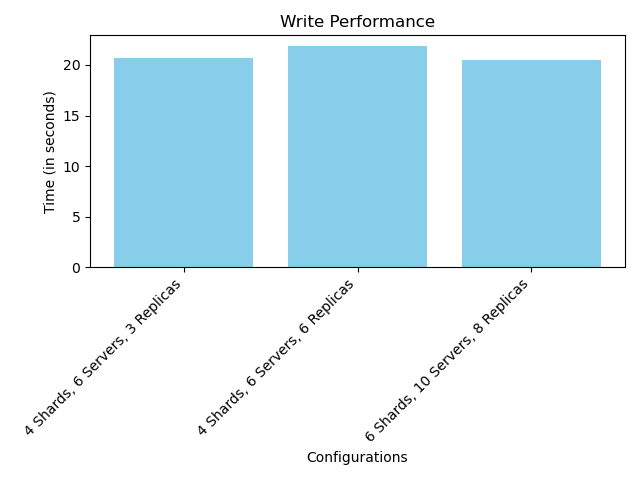
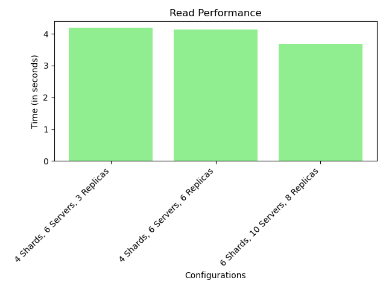

# <div align="center">galaxydb</div>

> galaxydb is a scalable database as a service using sharding written in Go. It is the descendent of our friendly old [Traffic Wizard](https://github.com/chirag-ghosh/traffic-wizard) and [GalaxyDB](https://github.com/Sarita-Singh/galaxyDB). RIP mates. Like it's parent and grandparent, this cute munchkin is also religious in it's own way and follows the Newest Testament found [here](bible_newest_testament.pdf). Lastly, this is the third (and hopefully last) assignment for Distributed Systems course taken by [Dr. Sandip Chakraborty](https://cse.iitkgp.ac.in/~sandipc/) for Spring-2024.

### Production

1. Ensure that you have `make`, `docker` and `docker-compose` installed.
2. In the project root folder, run `make`
3. To stop the containers, run `make stop`

---

# Hash Function used:

We used a hash function, which , after careful testing, returned a balanced output for the loadbalancer, enhancing the overall throughput of the system.

```bash
func H(i uint32) uint32 {
	i = (((i >> 16) ^ i) * 0x45d9f3b) >> 16 ^ i
	return i
}

func assistH(i, j uint32) uint32 {
	return H(i + H(j))
}
func hashRequest(i int) int {
	return int(assistH(uint32(i), uint32(i)))
}

func hashVirtualServer(i, j int) int {
	return int(assistH(uint32(i), uint32(j)))
}
```

# Distributed Database Performance Analysis

This README documents the performance analysis of a distributed database system under different configurations. The analysis focuses on measuring the read and write times to understand the impact of varying the number of shards, servers, and replicas.

## System Configuration

The distributed database system was tested under three different configurations to evaluate its performance:

1. Configuration 1: 4 Shards, 6 Servers, 3 Replicas
2. Configuration 2: 4 Shards, 6 Servers, 6 Replicas
3. Configuration 3: 6 Shards, 10 Servers, 8 Replicas

Each configuration was subjected to 10,000 write operations followed by 10,000 read operations to measure the system's performance.

## Methodology

The test setup involved initializing the distributed database with the specified configuration, performing the write operations, followed by the read operations. The time taken for these operations was recorded to analyze the system's performance under each configuration.

## Results

Below are the results showing the read and write times for each configuration. The results are also visualized in the form of graphs to provide a clear comparison.

### Configuration 1: 4 Shards, 6 Servers, 3 Replicas

- Write Time: 23.513784885406494 seconds
- Read Time: 48.415045 seconds





### Configuration 2: 4 Shards, 6 Servers, 6 Replicas

- Write Time: 31.36978554725647 seconds
- Read Time: 44.735289 seconds


### Configuration 3: 6 Shards, 10 Servers, 8 Replicas

- Write Time: 30.403273105621338 seconds
- Read Time: 46.32252900000001 seconds


### Combined:


